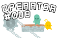
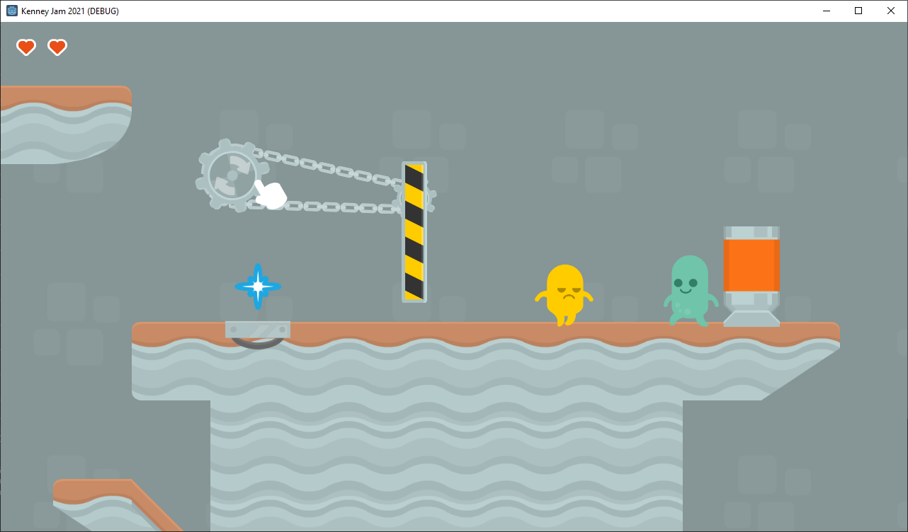
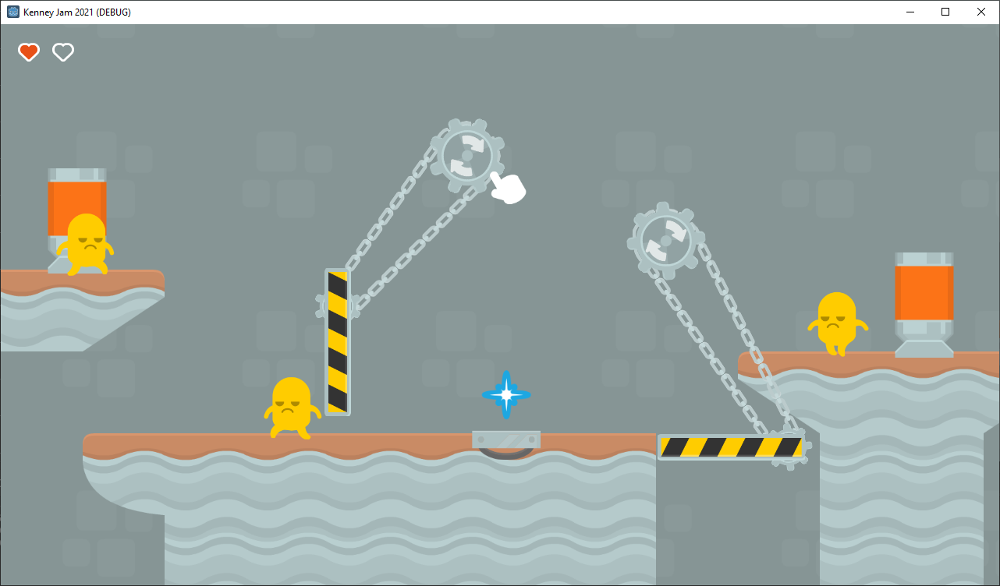
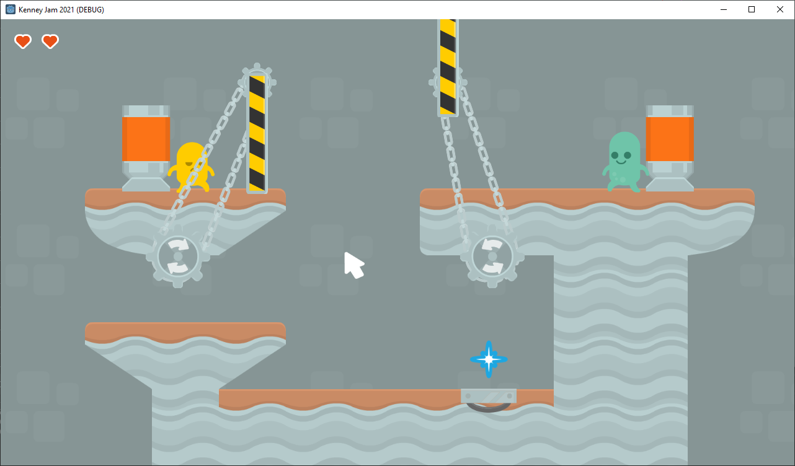

# Wormhole Operator
Game made for [Kenney Jam 2021](https://itch.io/jam/kenney-jam-2021) in theme of `Rotation`. Your mission is to help the ally aliens (green) to pass the portals and to prevent evil aliens (yellow) from entering to the other dimensions. Control the wormhole machine by rotating the gears to operate yellow-black stripped platforms.

It's a prototype puzzle/action game consisting only of four levels atm with support for mobile devices. Further updates about the game to be announced.

**Controls:**
 Mouse - drag to rotate the gears
 Touch - drag to rotate the gears

# Where to play

You can use direct link hosted by itch.io -
 https://lethiandev.itch.io/machinery-operator

Alternatively the game is also hosted on GitHub Pages -
 https://lethiandev.github.io/gd-wormhole-operator

# Credits
Programming and Design - [Konrad Nowakowski](https://github.com/lethiandev) (me)
 Graphics and Sound Effects - [Kenney](https://kenney.nl/)
 Music - [Children's March Theme by Cleyton Kauffman](https://opengameart.org/content/childrens-march-theme)

The game is powered by [Godot Engine v3.4](https://godotengine.org/).

# Screenshots

